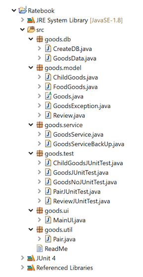

# RATEBOOK: A System for Rating Goods
-- CS622 Advanced Programming Techniques Term Project

## Summary Description

This project concerns a system for users to rate goods that have UPCs(universal product code). The rating system, called Ratebook, could be a web application.

Just like using Yelp to rate and review small business, by using this system, users can:
1) search for goods by UPC
2) search for goods by category and conditions
3) rate and review goods
4) view all the ratings and reviews of goods

Since UPC guarantees the unique identity of goods, users can easily and precisely find goods to rate and review by searching UPC(scanning the barcode can be expected in a future release). If the searched goods do not exist in the system, users can add goods(create new goods profile) by themselves. Users can rate the goods with score and write reviews to share their using experience. The focus of the term project is to achieve the rating system Ratebook with the above functions.

## Key Requirements

- #### Add Goods to Database
Ratebook shall support adding goods to the database. Users can create a new goods profile by writing information (including but not limited to category, UPC, name, brand, price range, rate counts, rating, and reviews) to the database that store all goods profiles.

- #### Update Goods to Database
Ratebook shall support updating goods information to the database. Users can update the old information of the existing goods.

- #### Search Goods by UPC from Database
Ratebook shall support searching for goods by UPC(barcode) from database. If the searched UPC exists in database, the program should display all information of the corresponding goods in console.

- #### Search Child Goods by Safe Age from Database
Ratebook shall support searching for child goods by safe age from database. Safe age is an important feature of child goods and are frequently used as searching filter. If the searched child goods exists in database, the system should display all information of the corresponding goods in console.

- #### Add Rating, Review and Purchased Price to Database
Ratebook shall support adding rating, review, and purchase price to the corresponding goods profile in database.

- #### Display all Goods from Database
Ratebook shall support displaying all goods in database. All the information stored in database will be displayed in console.

- #### Add goods in UI
Ratebook shall support users to add goods to database through UI. Users can click the tab named “Add Goods” and fill in goods’ UPC barcode, name, brand, and category in the corresponding input boxes. If one of input boxes is left blank, a warning “Barcode\Name\Brand\Category can’t be null.” will popup. If an existed barcode is entered, a warning “Goods has already existed in Ratebook!” will popup.

- #### List all goods in UI
Ratebook shall support displaying all goods from database in UI. Users can click the tab named “Goods List” to view all goods information. This function is impractical when the quantity of goods is large, but now it is useful for testing.

## Directory

## Design

## Run Instructions

1. Requires jfxrt.jar, jfxswt.jar, and sqlite-jdbc-3.34.0.jar in C:/lib.

2. The path of database file is "jdbc:sqlite:C:/lib/sqlite/ratebook.db", which can be changed in goods.db/CreateDB.java.

3. Run goods.db/CreateDB.java to create a database when first run the program.

4. Run goods.test/GoodsNoJUnitTest.java to test all the functions related to I/O.

5. Run goods.ui/MainUI.java to test the UI: list goods, add goods.

6. Other tests:

Run goods.test/GoodsJUnitTest.java to test methods in Goods class in goods.model package.

Run goods.test/ChildGoodsJUnitTest.java to test methods of ChildGoods class in goods.model package.

Run goods.test/ReviewJUnitTest.java to test methods of Review class in goods.model package.

Run goods.test/PairJUnitTest.java to test methods of Pair class in goods.util package.
